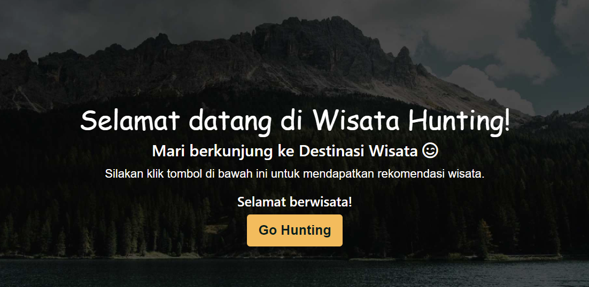

# Wisata Hunting

  

## Apa itu Wishunt ?

Wishunt adalah singkatan dari Wisata Hunting yang merupakan aplikasi untuk merekomendasikan tempat-tempat pariwisata yang menarik untuk para user. Dilengkapi dengan sistem rekomendasi yang dapat membantu user untuk semakin tertarik mengexplore wilayah indonesia dan melihat tempat tempat wisata yang mempesona. User juga dapat melatih wawasannya dengan quiz yang disediakan dalam website kami.

## Latar Belakang

Berkunjung ke tempat wisata merupakan salah satu kegiatan yang menyenangkan dan dapat memberikan ketenangan. Pada kondisi pandemi sekarang ini, akses tempat wisata ditutup mengacu pada kebijakan yang diberikan oleh pemerintah. Setelah melakukan survey kepada 74 responden terkait pariwisata, 66 orang atau 89% mengatakan akan berkunjung ke tempat wisata setelah akses tempat umum kembali dibuka, 53 orang atau sekitar 72% responden mengatakan membutuhkan semacam informasi berupa rekomendasi tempat wisata yang dapat dikunjungi untuk memudahkan mereka dalam memilih tempat wisata.

## Penjelasan Algoritma
Algoritma yang digunakan untuk project ini adalah algoritma *cosine similarity*. *Cosine Similarity* merupakan model yang menghitung similaritas antara satu item dengan lainnya sehingga bisa dinyatakan bahwa item satu dengan lainnya mirip atau serupa. Cara menghitung *cosine similarity* adalah sebagai gambar dibawah ini :

## Cara Penggunaan
- <a href="https://drive.google.com/file/d/1B7gPjVcwRKGJ-UTzK2hMDceHrxWpJbjg/view?usp=sharing" >Link demo.</a> 
- <a href="https://tourist-recommendation-7b37.hostman.site/" >Wisata Hunting</a>

## Team ID : CSD-019

 

| Name                          | Student ID | Contact                              |  
| ---------------------         | ---------- | ------------------------------------ |
| Christopher Alvin Buana       | M306R7317  |    |
| Kori Isabella Hutabarat       | M352V6382  |    |  |
 

## Credits
- Dataset           : <a href = "https://www.kaggle.com/aprabowo/indonesia-tourism-destination">Indonesia Tourism Destination</a>
- Css Framework     : <a href = "https://getbootstrap.com/">Bootstrap</a>
- Machine Learning  : <a href = "https://www.tensorflow.org/">Tensorflow</a>
- Hosting API       : <a href = "https://www.heroku.com">Heroku</a>
- Web Hosting       : <a href = "https://hostman.com">Hostman</a>
- Rest API          : <a href = "https://flask.palletsprojects.com/en/2.0.x/">Flask</a>
- Jumbotron : <a href = "https://www.freepik.com/free-photo/beautiful-shot-lake-with-mountains-background_17232107.htm#query=danau%20toba&position=23&from_view=search">Wirestock Freepik</a>
- Description img : <a href = "https://www.freepik.com/free-photo/pura-ulun-danu-bratan-bali-hindu-temple-surrounded-by-flowers-bratan-lake_8270060.htm#query=ulun%20danu&position=5&from_view=keyword">Halayalex - Freepik</a>

